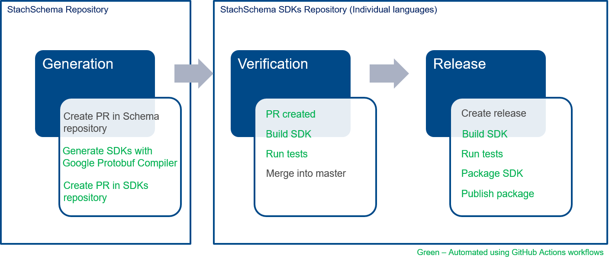

<div></div>
<h4 style="margin-top:0">A <u>s</u>chema for <u>ta</u>bles and <u>ch</u>arts</h4>

This schema defines the format of tabular data, the relationships between columns, rows, headers, and metadata, and the binding of tables to charts. It is meant to standardize the format of tabular data between the service layer and the user interface layer.

## Overview

Tables can be more complex than a two-dimensional array of data. There are structural relationships that are important for understanding how data is related in order to facilitate human consumption. By retaining this information, it allows these relationships created in one application to be carried over to another application without having to redo this work. Once those relationships are defined, they can drive how tables are bound to charts.

## Serialization

All JSON properties are serialized using [camel casing](https://en.wikipedia.org/wiki/Camel_case) even though the protobuf schema uses [snake casing](https://en.wikipedia.org/wiki/Snake_case) due to protobuf's [JSON Mapping](https://developers.google.com/protocol-buffers/docs/proto3#json). Therefore, message field names are mapped to lowerCamelCase and become JSON object keys.

## Get Started

### Install

[](https://mvnrepository.com/artifact/com.factset.protobuf/stach)
[](https://www.nuget.org/packages/FactSet.Protobuf.Stach)
[](https://pypi.org/project/fds.protobuf.stach/)
[](https://cran.r-project.org/web/packages/factset.protobuf.stach/index.html)
[](https://github.com/factset/stachschema/tree/master/go)


The following SDKs facilitate serialization.

   | Framework | Repository |
   |-----------|------------|
   | DotNet    | https://www.nuget.org/packages/FactSet.Protobuf.Stach/    |
   | Java      | https://mvnrepository.com/artifact/com.factset.protobuf/stach |
   | Python    | https://pypi.org/project/fds.protobuf.stach/ |
   | R         | https://cran.r-project.org/web/packages/factset.protobuf.stach/index.html |
   | Go        | https://github.com/factset/stachschema/tree/master/go |
   
### Repository structure

1. [Stachschema](https://github.com/factset/stachschema) - STACH Protobuf Schema and its documentation is maintained in this repository.

2. [Stachschema SDKs](https://github.com/factset/stachschema-sdks) - Auto-generated schema’s source code using the Google Protobuf compiler.

### Generate SDKs

#### Using GitHub Actions based automation



**Generation:**
* Raise a pull request with required changes to the STACH schema repository. This would trigger a GitHub Actions workflow to raise a pull request on to the StachSchema SDKs repository with corresponsing changes in the SDK source code.  

**Verification:**
* On the SDK's pull request, make sure that all the existing unit tests are successful (GitHub Actions workflow is configured to run the unit tests and the status of the same will be updated on the pull request).
* Increment the SDK package versions and implement new unit tests as required.
* Merge the pull request if everything is good. 

**Release:**
* Create a release tag on StachSchema SDKs repository which should trigger a GitHub Actions workflow to release the SDKs on package managers.

Note: Currently, we can release only on NuGet and PyPi automatically with the GitHub Actions workflow.

#### On local machine

**Prerequisites:**
* Install [Docker](https://docs.docker.com/get-docker/) and make sure that it is running.

**Steps:**
* Clone the [StachSchema](https://github.com/factset/stachschema) and [StachSchema](https://github.com/factset/stachschema-sdks) SDKs repository.
* Make the required changes to the [STACH schema](https://github.com/factset/stachschema/tree/master/proto) ProtoBuf schema.
* Set the below environment variable.
```
# Powershell
$env:SCHEMA=$(pwd)/stachschema/proto
```
* Move into the StachSchema SDKs repository and run the below command.
  - To generate or update all language SDKs.
```
docker-compose -f docker-compose.generate.yml up --remove-orphans
```
  - To generate or update any specific langauge SDK.
```
docker-compose -f docker-compose.generate.yml up --remove-orphans --build dotnet
```
* Increment the SDK versions as required and fix the unit tests in SDKs.
* Raise the pull requests for the changes made in both the repositories.

### Build SDKs

* Move into the StachSchema SDKs repository.
  - To build and run unit tests of all language SDKs.
```
docker-compose -f docker-compose.build.yml build
```
  - To build and run unit tests of any specific language SDK.
```
docker-compose -f docker-compose.build.yml build dotnet
```
* To copy the built SDK into the local machine.
```
docker-compose -f docker-compose.build.yml up --remove-orphans --build dotnet
docker cp stachschema-sdks_dotnet_1:/dotnet .
```

## Contributing

Contributions are what make the open source community such an amazing place to be learn, inspire, and create. Any contributions you make are **greatly appreciated**.

**[StachSchema](https://github.com/factset/stachschema):**

* To contribute to the STACH schema, refer to the [Generation](README?id=generate-sdks) steps.
* For improvements or changes to the documentation, please create pull requests with the proposed changes.

**[StachSchema SDKs](https://github.com/factset/stachschema-sdks):**
* Source code in each language directory is auto-generated and should not be manually edited. Refer to [Generation](README?id=generate-sdks) steps to know, how SDKs source code is auto-generated.
* Unit tests are open for enhancements and bug fixes. Please create pull requests with the proposed changes. 

## License

Distributed under the Apache License v2.0. See [LICENSE](LICENSE.txt ':ignore :target=_blank') for more information.